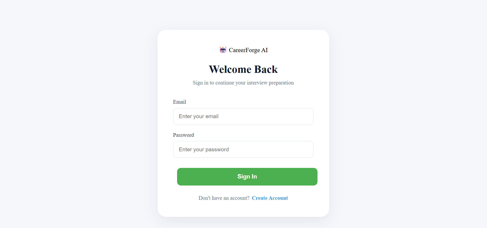
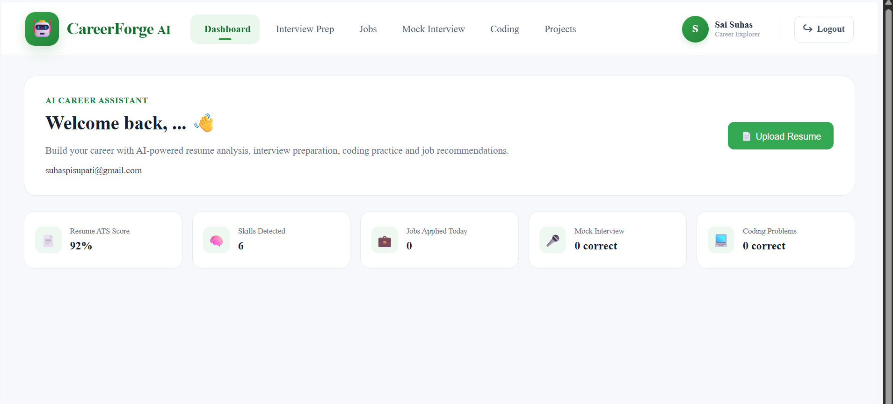
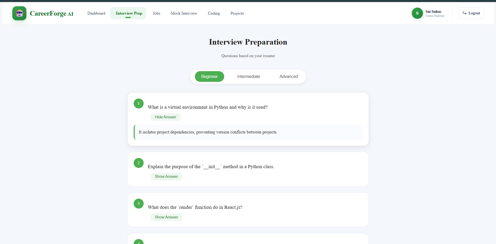
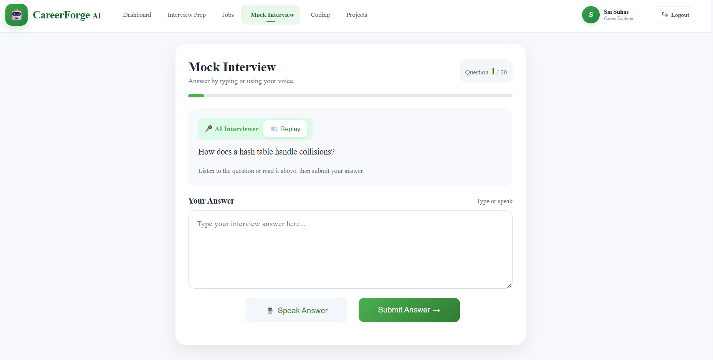
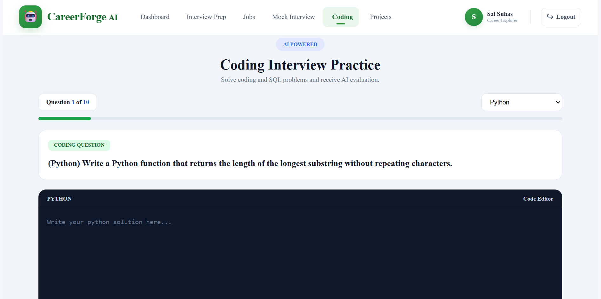
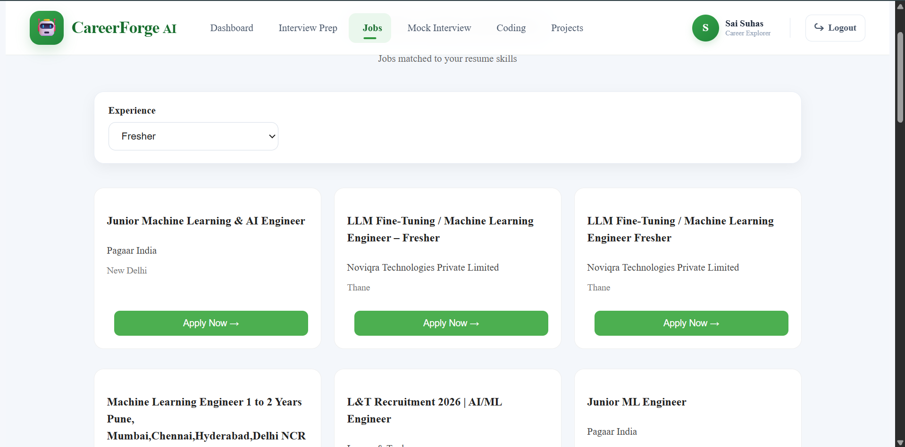
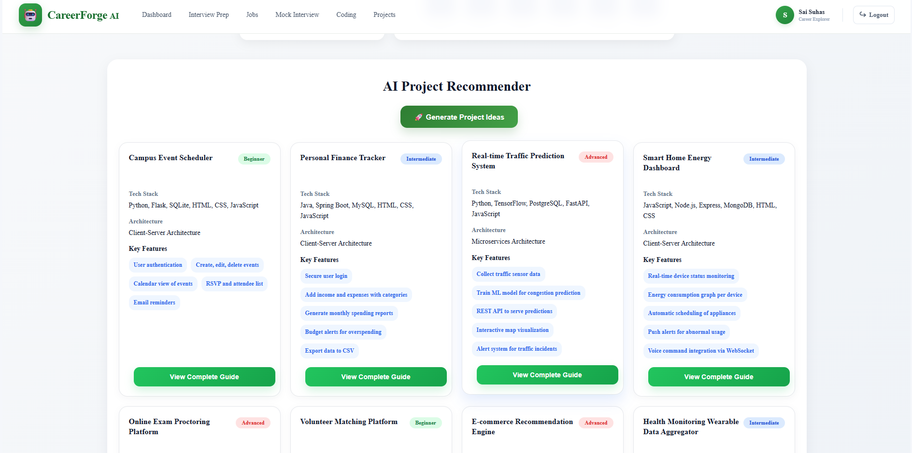
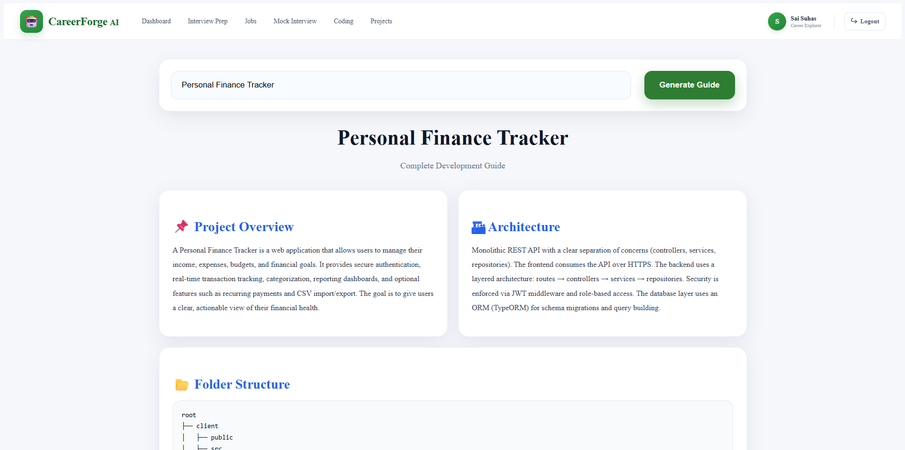

# 🚀 Career Forge AI

### AI-Powered Career Assistant for Students and Job Seekers

Career Forge AI is a full-stack AI-powered career assistance platform designed to help students and job seekers analyze their resumes, prepare for interviews, practice coding, discover relevant jobs, and build career-focused projects.

The platform combines Artificial Intelligence, Resume Analysis, Interview Preparation, Coding Practice, Job Recommendations, and AI Project Guidance into a single application.

---

## 🌐 Live Demo

🔗 **Live Application:**  
https://carrer-forge-ai-git-main-suhas3.vercel.app

---

# 📌 Project Overview

Finding the right job and preparing for technical interviews can be challenging for students and fresh graduates.

Career Forge AI provides an integrated platform that helps users:

- Analyze their resume
- Check ATS compatibility
- Extract technical skills
- Generate interview questions
- Practice AI-powered mock interviews
- Practice coding questions
- Get AI feedback on coding solutions
- Find job recommendations
- Generate personalized project ideas
- Get complete implementation guides for projects

The system uses AI to personalize the career preparation experience based on the user's resume and skills.

---

# ✨ Key Features

## 🔐 1. User Authentication

- User registration
- User login
- Authentication data storage
- Browser local storage where applicable

---

## 📄 2. AI Resume Analyzer

Upload a resume and receive AI-powered analysis.

### Features

- Resume text extraction
- ATS score
- Skill extraction
- Resume strength analysis
- Job role identification
- Resume improvement suggestions
- AI-generated improved resume

---

## 🧠 3. AI Interview Preparation

Generate interview questions based on the user's resume and skills.

### Difficulty Levels

- Beginner
- Intermediate
- Advanced

### Features

- AI-generated questions
- Expandable answers
- Resume-based interview preparation
- Technical and project-related questions

---

## 💬 4. AI Interview Chatbot

An interactive AI chatbot that helps users prepare for interviews.

The chatbot can:

- Answer interview-related questions
- Explain technical concepts
- Provide preparation guidance
- Discuss resume-related topics
- Help users practice interview communication

---

## 🎤 5. AI Mock Interview

Practice a complete AI-powered mock interview.

### Features

- AI-generated interview questions
- One-question-at-a-time interview flow
- Text-based answers
- Voice-based answers
- AI evaluation
- Answer feedback
- Score generation
- Progress tracking
- 10-question mock interview

---

## 💻 6. AI Coding Interview

Practice coding questions generated by AI.

### Supported Languages

- Python
- Java
- C
- C++
- SQL

### Features

- AI-generated coding questions
- Code editor
- Programming language selection
- Code execution
- Output display
- Code submission
- AI-based evaluation
- Correctness analysis
- Time complexity analysis
- Code quality feedback
- Optimization suggestions

---

## 💼 7. AI Job Recommendations

Get job recommendations based on the skills and roles identified from the user's resume.

### Features

- Resume-based job recommendations
- Skill-based matching
- Job role identification
- Job listings
- Location information
- Job links
- AI job chatbot

---

## 🚀 8. AI Project Recommendations

Generate project ideas based on the user's technical skills.

The AI recommends projects that can help users:

- Improve technical skills
- Build their portfolio
- Strengthen their resume
- Prepare for interviews
- Gain practical development experience

---

## 📚 9. AI Project Guide

Users can select a recommended project or enter their own project title.

The AI generates a complete project implementation guide.

### Guide Includes

- Project overview
- Project objectives
- System architecture
- Folder structure
- Database design
- API design
- Development steps
- Advanced features
- Learning resources

---

# 📸 Screenshots

All application screenshots are available in the `screenshots/` folder.

## 🔐 Login & Registration



---

## 📊 Dashboard



---

## 🧠 Interview Preparation



---

## 🎤 AI Mock Interview



---

## 💻 AI Coding Interview



---

## 💼 Job Recommendations



---

## 🚀 Project Recommendations



---

## 📚 Project Guide



---

# 🏗️ System Architecture

```text
                        ┌──────────────────────┐
                        │      User            │
                        │  Web Browser         │
                        └──────────┬───────────┘
                                   │
                                   ▼
                        ┌──────────────────────┐
                        │   React Frontend     │
                        │   JavaScript + CSS   │
                        └──────────┬───────────┘
                                   │
                              REST APIs
                                   │
                                   ▼
                        ┌──────────────────────┐
                        │   FastAPI Backend    │
                        │      Python          │
                        └──────────┬───────────┘
                                   │
             ┌─────────────────────┼─────────────────────┐
             │                     │                     │
             ▼                     ▼                     ▼
     ┌──────────────┐      ┌──────────────┐      ┌──────────────┐
     │ Resume       │      │ AI Engine    │      │ Job Search   │
     │ Processing   │      │              │      │              │
     └──────────────┘      └──────┬───────┘      └──────────────┘
                                  │
                                  ▼
                         ┌──────────────────┐
                         │    Groq API      │
                         │      LLM         │
                         └──────────────────┘
🛠️ Technology Stack
Frontend
React.js
JavaScript
HTML5
CSS3
Axios
React Router
Backend
Python
FastAPI
REST APIs
Uvicorn
Artificial Intelligence
Groq API
Large Language Models (LLMs)
AI Prompt Engineering
Resume Processing
PDF Resume Parsing
Resume Text Extraction
Skill Extraction
Resume Analysis
ATS Analysis
Database / Storage
User Authentication Storage
Browser Local Storage where applicable
Deployment
Vercel
Render

📂 Project Structure
Career-Forge-AI/
│
├── backend/
│   │
│   ├── main.py
│   ├── ai_engine.py
│   ├── coding_engine.py
│   ├── interview_engine.py
│   ├── project_engine.py
│   ├── resume_parser.py
│   ├── job_search.py
│   ├── utils.py
│   ├── requirements.txt
│   ├── .env.example
│   └── ...
│
├── frontend/
│   │
│   ├── public/
│   │
│   ├── src/
│   │   ├── components/
│   │   │
│   │   ├── pages/
│   │   │   ├── Dashboard.js
│   │   │   ├── InterviewPrep.js
│   │   │   ├── MockInterview.js
│   │   │   ├── CodingRound.js
│   │   │   ├── JobRecommendations.js
│   │   │   ├── ProjectRecommendations.js
│   │   │   └── ProjectGuide.js
│   │   │
│   │   ├── App.js
│   │   ├── api.js
│   │   └── ...
│   │
│   └── package.json
│
├── screenshots/
│   ├── login.png
│   ├── dashboard.png
│   ├── interview-preparation.png
│   ├── mock-interview.png
│   ├── coding-interview.png
│   ├── job-recommendations.png
│   ├── project-recommendations.png
│   └── project-guide.png
│
├── README.md
└── .gitignore
⚙️ Local Installation

1. Clone the repository
git clone https://github.com/YOUR_USERNAME/YOUR_REPOSITORY.git
cd Career-Forge-AI

🔧 Backend Setup

Go to the backend directory:

cd backend

Create a virtual environment:

python -m venv venv

Activate it on Windows:

venv\Scripts\activate

Install dependencies:

pip install -r requirements.txt

🔑 Environment Variables

Create:

backend/.env

Add:

GROQ_API_KEY=your_groq_api_key

Never commit your .env file to GitHub.

▶️ Run Backend
uvicorn main:app --reload

Backend will run at:

http://127.0.0.1:8000

API documentation:

http://127.0.0.1:8000/docs

💻 Frontend Setup

Open another terminal.

cd frontend

Install dependencies:

npm install

Create:

frontend/.env

Add:

REACT_APP_API_URL=http://127.0.0.1:8000

Run the frontend:

npm start

The application will open at:

http://localhost:

🔐 Security

API keys and environment variables are not included in the repository.

Sensitive configuration is stored using environment variables.

Example:

GROQ_API_KEY=your_api_key

🚀 Deployment

The application is deployed using:

Frontend

Vercel

Backend

Render

AI

Groq API

🎯Future Improvements

Possible future improvements include:

Advanced coding sandbox
More programming languages
Detailed interview analytics
Resume version comparison
Interview performance dashboard
More job sources
Personalized learning recommendations
Advanced authentication
Database-backed user profiles

👨‍💻 Developer
Sai Suhas Pisupati
B.Tech Computer Science & Engineering Graduate

Interested in:

Python Development
AI/ML
Backend Development
Software Engineering
Generative AI

⭐ Support

If you find this project useful, consider giving the repository a ⭐ on GitHub.

📜 License

This project is developed for educational and portfolio purposes.

https://github.com/Suhas-Pisupati/CarrerForge-AI